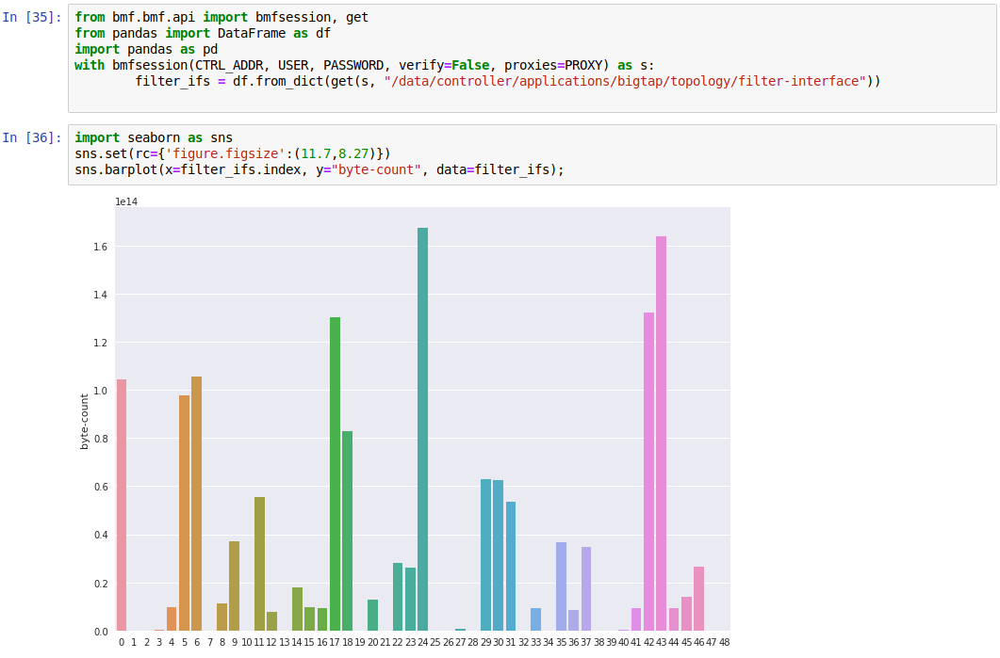

# BMF python rest client

Very simple library to contol BMF controller (read-only atm).

## Getting Started

Just import and use the built-in context manager `bmfsession`. Session login and logout is taken care implicitly, so no need to worry.

usage example:

```python
from bmf.api import bmfsession, get

with bmfsession(CONTROLLER_ADDR, USER, PASSWORD) as s:
    print(get(s, "/core/switch"))
```

easy as that.

Jupyter example:



### Prerequisites

Project depends on Python 3 and the `requests` library.

### Installing

Packaging is not implemented. `git clone` and import.

## Authors

* **srozb** - [srozb](https://github.com/srozb)

## License

This project is licensed under the MIT License - see the [LICENSE.md](LICENSE.md) file for details
